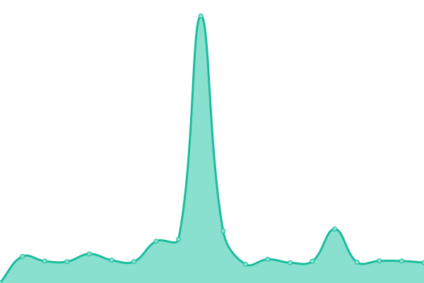

# [📈 Live Status](https://devnullsans.github.io/upptime-monitor): <!--live status--> **🟧 Partial outage**

This repository contains the open-source uptime monitor and status page for [Paul S](https://devnullsans.github.io/upptime-monitor), powered by [Upptime](https://github.com/upptime/upptime).

With [Upptime](https://upptime.js.org), you can get your own unlimited and free uptime monitor and status page, powered entirely by a GitHub repository. We use [Issues](https://github.com/devnullsans/upptime-monitor/issues) as incident reports, [Actions](https://github.com/devnullsans/upptime-monitor/actions) as uptime monitors, and [Pages](https://devnullsans.github.io/upptime-monitor) for the status page.

<!--start: status pages-->
<!-- This summary is generated by Upptime (https://github.com/upptime/upptime) -->
<!-- Do not edit this manually, your changes will be overwritten -->
<!-- prettier-ignore -->
| URL | Status | History | Response Time | Uptime |
| --- | ------ | ------- | ------------- | ------ |
|  [Photoz ICVJ](https://photoz-icvj.onrender.com/ping) | 🟥 Down | [photoz-icvj.yml](https://github.com/devnullsans/upptime-monitor/commits/HEAD/history/photoz-icvj.yml) | 

 4496ms
     
 | 

<a href="https://devnullsans.github.io/upptime-monitor/history/photoz-icvj">95.00%</a>
    

|  [Message Board](https://msg-board-server.onrender.com/ping) | 🟩 Up | [message-board.yml](https://github.com/devnullsans/upptime-monitor/commits/HEAD/history/message-board.yml) | 

 4005ms
     
 | 

<a href="https://devnullsans.github.io/upptime-monitor/history/message-board">93.94%</a>
    

<!--end: status pages-->

[**Visit our status website →**](https://devnullsans.github.io/upptime-monitor)

## 📄 License

- Powered by: [Upptime](https://github.com/upptime/upptime)
- Code: [MIT](./LICENSE) © [Anand Chowdhary](https://anandchowdhary.com), supported by [Pabio](https://pabio.com)
- Data in the `./history` directory: [Open Database License](https://opendatacommons.org/licenses/odbl/1-0/)
